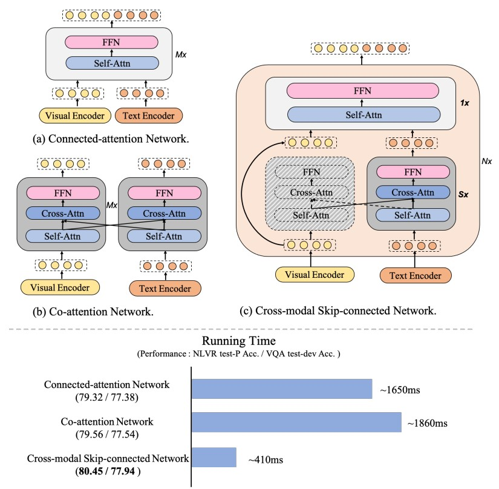
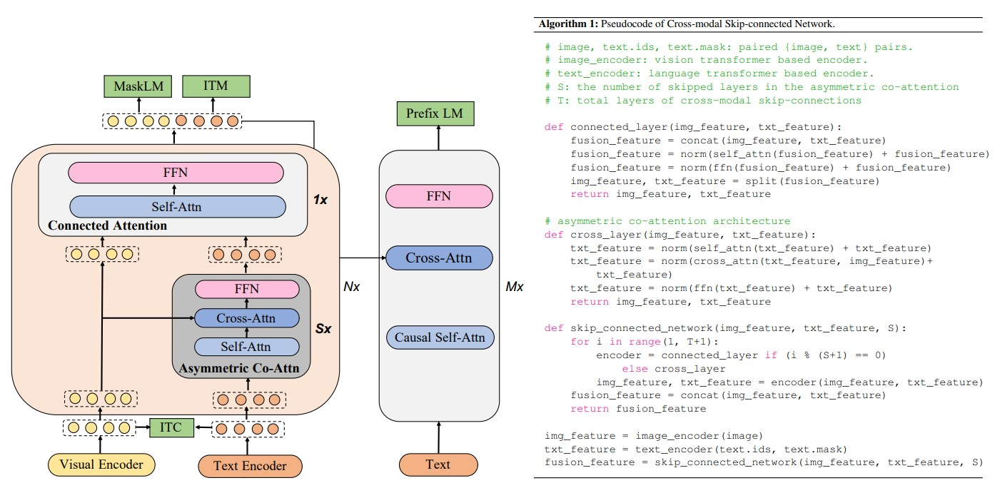
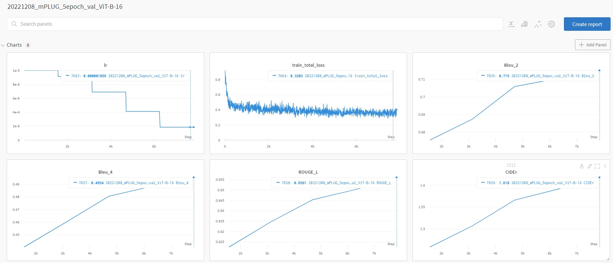

# Image Caption

Author: RongjiXun 2682414501@qq.com

> [Blog tutorial](https://medium.com/towards-data-science/image-captioning-with-keras-teaching-computers-to-describe-pictures-c88a46a311b8)
> [VQA Task LeaderBoard](https://paperswithcode.com/sota/visual-question-answering-on-vqa-v2-test-dev)

图像描述：给定一张图片，模型根据图片信息生成一句对应描述。可以应用于给一张图片配上一句文字或者打个标签的场景。

<center>
	
    <br>
    <div style="color:orange; border-bottom: 1px solid #d9d9d9;
    display: inline-block;
    color: #999;
    padding: 2px;">
        PredResult= `a man in a red jacket talking on a cell phone`
    </div>
</center>

## review

> [A Comprehensive Survey of Deep Learning for Image Captioning paper](https://arxiv.org/abs/1810.04020)
> [local pdf](./docs/2020_c506_AComprehensiveSurveyOfDeepLearningForImageCaptioning.pdf)

Generating a description of an image is called image captioning. Image captioning requires to recognize the important objects, their attributes and their relationships in an image. It also needs to generate syntactically and semantically correct sentences. Deep learning-based techniques are capable of handling the complexities and challenges of image captioning. 


### metrics

> [NLP metrics blog](https://towardsdatascience.com/foundations-of-nlp-explained-bleu-score-and-wer-metrics-1a5ba06d812b)
> [BLEU 参考](https://towardsdatascience.com/foundations-of-nlp-explained-bleu-score-and-wer-metrics-1a5ba06d812b) :star:

#### BLEU

BLEU(**B**i-**L**ingual **E**valuation **U**nderstudy) 得分是一个 0 到 1 之间的数字，用于衡量机器翻译文本与一组高质量参考翻译的相似度。0 表示机器翻译的输出与参考翻译没有重叠，而 1 表示其与参考翻译完全重叠（高质量）。A **score of 0.6 or 0.7 is considered the best you can achieve.** Even two humans would likely come up with different sentence variants for a problem, and would rarely achieve a perfect match.

- `N-gram`：a set of **’n’ consecutive words in a sentence**

  For instance, in the sentence “The ball is blue”, we could have n-grams such as:

  ```
  1-gram (unigram): “The”, “ball”, “is”, “blue”
  2-gram (bigram): “The ball”, “ball is”, “is blue”
  3-gram (trigram): “The ball is”, “ball is blue”
  4-gram: “The ball is blue”
  ```

  > :warning: Note that **the words in an n-gram are taken in order**, so “blue is The ball” is not a valid 4-gram.

- `Precision` : measures the **number of words in the Predicted Sentence that also occur in the Target Sentence**.

  Target Sentence: He eats an apple

  Predicted Sentence: He ate an apple >> Precision = 3/4

  - **Repetition Problem** :shit:

    ```
    Target Sentence: He eats an apple
    Predicted Sentence: He He He 
    >> Precision = 3/3
    ```

  - Clipped Precision :+1:
    In many NLP models, we might be given multiple acceptable target sentences that capture these different variations. 参考句子可以有多个句子表示（语序不同，意思类似）
    预测的句子里面有 3个 He，而多个参考句子，每个句子最多只有1个He，`Clipped Precision` 认为只匹配上1个，而不是认为匹配成功3次》》解决 repetition 问题。

  > 后续 Precision 使用 Clipped Precision

- 计算 BLEU

  1. 计算 N-gram >> N 个 Clipped-Precision

  2. $GeometricAverargePrecision={\prod_{n=1}^{N}{p_n^{w_n}}}$ 
     其中 N >> N-gram， $w_n=1/N$ 

  3. Brevity Penalty
     Model outputs a predicted sentence consisting of a single word like “The’ or “late”. For this, the 1-gram Precision would have been 1/1 = 1, indicating a perfect score. This is obviously misleading because it encourages the model to output fewer words and get a high score. Brevity Penalty **penalizes sentences that are too short.**
     $$
     BrevityPenalty = \begin{cases}
     1 & if \quad {c>r}\\
     exp(1-\frac{r}{c}) & if \quad c<=r \\
     \end{cases}
     $$

     - c is *predicted length = number of words in the predicted sentence* and
     - r is *target length = number of words in the target sentence*

     

  4. Bleu Score
     $$
     BLEU(N) = BrevityPenalty * GeometricAverargePrecision(N)
     $$
     Bleu Score can be computed for different values of N. Typically, we use N = 4.

     - BLEU-1 uses the unigram Precision score
     - BLEU-2 uses the geometric average of unigram and bigram precision
     - BLEU-3 uses the geometric average of unigram, bigram, and trigram precision

```python
import nltk

hyp1 = ['It', 'is', 'a', 'guide', 'to', 'action', 'which',
         'ensures', 'that', 'the', 'military', 'always',
        'obeys', 'the', 'commands', 'of', 'the', 'party']
ref1a = ['It', 'is', 'a', 'guide', 'to', 'action', 'that',
         'ensures', 'that', 'the', 'military', 'will', 'forever',
          'heed', 'Party', 'commands']
ref1b = ['It', 'is', 'the', 'guiding', 'principle', 'which',
          'guarantees', 'the', 'military', 'forces', 'always',
          'being', 'under', 'the', 'command', 'of', 'the', 'Party']
ref1c = ['It', 'is', 'the', 'practical', 'guide', 'for', 'the',
          'army', 'always', 'to', 'heed', 'the', 'directions',
          'of', 'the', 'party']

hyp2 = ['he', 'read', 'the', 'book', 'because', 'he', 'was',
       'interested', 'in', 'world', 'history']
ref2a = ['he', 'was', 'interested', 'in', 'world', 'history',
        'because', 'he', 'read', 'the', 'book']

list_of_references = [[ref1a, ref1b, ref1c], [ref2a]]
hypotheses = [hyp1, hyp2]
nltk.translate.bleu_score.corpus_bleu(list_of_references, hypotheses)  # 0.5920
```


- Weaknesses of Bleu Score
  - It **does not consider the meaning of words**. It is perfectly acceptable to a human to use a different word with the same meaning eg. Use “watchman” instead of “guard”. But Bleu Score considers that an incorrect word.
  - It **looks only for exact word matches**. Sometimes a variant of the same word can be used eg. “rain” and “raining”, but Bleu Score counts that as an error.
  - It **ignores the importance of words**. With Bleu Score an incorrect word like “to” or “an” that is less relevant to the sentence is penalized just as heavily as a word that contributes significantly to the meaning of the sentence.
  - It **does not consider the order of words eg**. The sentence “The guard arrived late because of the rain” and “The rain arrived late because of the guard” would get the same (unigram) Bleu Score even though the latter is quite different.

- WER
  Although Automatic Speech Recognition models also output text, the target sentence is unambiguous and usually not subject to interpretation. In this case, Bleu Score is not the ideal metric.

  The metric that is typically used for these applications is Word Error Rate (WER), or its sibling, Character Error Rate (CER). It compares the predicted output and the target transcript, word by word (or character by character) to figure out the number of differences between them.
  $$
  WordErrorRate=\frac{Insert+Delete+Substituted}{\text{Total words Num in ref}}
  $$

#### `CIDEr`

> [参考](https://www.cv-foundation.org/openaccess/content_cvpr_2015/papers/Vedantam_CIDEr_Consensus-Based_Image_2015_CVPR_paper.pdf)  [local pdf](./docs/2015_CVPR_metrics_Cider_Consensus-basedImageDescriptionEvaluation.pdf)


### dataset

#### COCO

> [COCO Data JSON Format](https://cocodataset.org/#format-data)

The annotations are stored using [JSON](http://json.org/). Please note that the [COCO API](https://github.com/cocodataset/cocoapi) described on the [download](https://cocodataset.org/#download) page can be used to access and manipulate all annotations. All annotations share the same basic data structure below

```json
{
"info": info, "images": [image], "annotations": [annotation], "licenses": [license],
}

info{
"year": int, "version": str, "description": str, "contributor": str, "url": str, "date_created": datetime,
}

image{
"id": int, "width": int, "height": int, "file_name": str, "license": int, "flickr_url": str, "coco_url": str, "date_captured": datetime,
}

license{
"id": int, "name": str, "url": str,
}
```

- Image Captioning
  Each caption describes the specified image and **each image has at least 5 captions (some images have more).**

  ```json
  annotation{
  "id": int, "image_id": int, "caption": str,
  }
  ```

- COCO Image Captioning Evaluate Format

  ```json
  [{
  "image_id": int, "caption": str,
  }]
  ```


## mPLUG :star:

> [Github 官方仓库](https://github.com/alibaba/AliceMind/tree/main/mPLUG) 
> [mPLUG ImageCaptioning官方文档](https://www.modelscope.cn/models/damo/mplug_image-captioning_coco_large_en/summary)
> [local paper pdf](./docs/2022_mPLUG_EffectiveAndEfficientVision-languageLearningByCross-modalSkip-connections.pdf)  [local repository code](./mPLUG_imageCaptioning)
>
> [博客参考](https://zhuanlan.zhihu.com/p/586724180)

- Probelm
  Most existing pre-trained models suffer from the problems of **low computational efficiency** and **information asymmetry** brought by the long visual sequence in cross-modal alignment.

- Purposed idea :sun_with_face:
  mPLUG **introduces an effective and efficient vision-language architecture** with novel **cross-modal skip-connections**, which creates *inter-layer shortcuts that skip a certain number of layers for time-consuming full self-attention on the vision side*.
  mPLUG 提出一种 cross-modal skip-connections 模态融合结构，内部注意力模块，**视觉特征进行注意力操作很耗时**，因此弄了一个 inter-layer 在指定层数下，不对视觉特征进行注意力操作。
  
  > 视觉（图像），文本多模态融合：图像含有更多信息，而文本体现出来的信息相对来说更少，即客观上这两种模态数据含有的信息量不同（Information asymmetry）。
  >
  > - mPLUG strength :muscle:
  >   - end2end 图像文本对数据，预训练模型
  >   - 在多个Vision-Language 下游任务：ImageCaptioning, VisualQuestionAnswering, imageTextRetrieval, VisualGrounding 效果 SOTA
  >   - **很强的 zero-shot 迁移能力** :+1:
  
  <center>
  	
      <br>
      <div style="color:orange; border-bottom: 1px solid #d9d9d9;
      display: inline-block;
      color: #999;
      padding: 2px;">
          Fig1: Illustration of two conventional cross-modal
  fusion networks and mPLUG proposed cross-modal skip-connected network.
      </div>
  </center>

- Introduction
   A **great challenge of learning vision-language models** is to find a good alignment between the two modalities to close the semantic gap in-between.
    	Visual-Language 的一个*巨大挑战是在这两种模态之间找到良好的对齐方式*，以缩小两者之间的语义差距**。先前的研究使用预先训练的对象检测器（Faster-rcnn的提议框）从图像中提取显著的目标区域，然后与语言对应的对象对齐，这种方法通常受到对象检测器的能力、它可以表示的预定义的视觉语义以及可用的注释的数量的限制。最近的工作以端到端的方式实现了图像和文本表示之间的直接对齐，通过图像patch或网格提取更细粒度的视觉表示，然而，在建模长视觉序列时存在两个重大问题：**1）效率：长视觉序列上的自注意力比文本序列上的计算量多很多**；2）信息不对称：广泛使用的图像文本预训练数据中的标题文本通常较短且高度抽象，而可以**从图像中提取更详细和多样的信息**。这种不对称性对模态之间的有效多模态融合提出了挑战。

### 3 Fusion Module <Fig1> :star:

- Connected-attention Network <Fig1 a>

  adopts a single Transformer  network for early fusion of vision and language by simply taking the **concatenation** of visual and linguistic features as input.
  直接 concatenate 两个模态的特征，用一个 Transformer 学习两个模态相互的关系，很耗时。没有考虑信息不对称问题，此方式将视觉、文本的信息量相等。

  > :shit: 当文本、图像的各自的信息量差异较大的时候，受信息不对称影响很严重

  - Co-attention Network
    keeps **separate Transformer networks for both textual and visual features**, and uses techniques such as cross-attention to enable cross-modal interaction 
    视觉、文本各自用一个 Transformer 提取特征，缓解了*信息不对称*问题
    
    > :shit: 计算效率低，用2个transformer 参数量变多了，low parameter-efficiency 
    
  - Cross-modal Skip-Connect Network :fire: mPLUG 提出的融合方法
    
    each block of our **cross-modal skip-connected network**
    
    - mPLUG first adopts an asymmetric co-attention architecture at the **first few layers for efficiency, by removing the co-attention on vision side.** 
    - It is then followed by one layer of connected-attention, by **concatenating** the original visual representation and the co-attention output on the language side as input. 
    - In addition to the **modeling efficacy** due to the asymmetry, the cross-modal skip-connections ease the model training by alleviating vanishing gradients with the inserted shortcuts


- mPLUG model architecture

  <center>
  	
      <br>
      <div style="color:orange; border-bottom: 1px solid #d9d9d9;
      display: inline-block;
      color: #999;
      padding: 2px;">
          Figure 2: The model architecture and objectives of mPLUG, which consists of two unimodal encoders for images
  and text separately, a cross-modal skip-connected network and a decoder for text generation. An image-text contrastive loss is first applied to align the unimodal representations from the visual encoder and text encoder. Then,
  we use a novel cross-modal skip-connected network to fuse the visual and linguistic representations effectively and
  efficiently. We adopt connected cross-modal fusion to every S asymmetric co-attention layers, where S is a fixed
  stride value. Based on the connected representation of the image and prefix sub-sequence, the decoder is trained
  with a prefix language modeling (Prefix LM) loss by generating the remaining caption
      </div>
  </center>

为了更好地建模固有的模态偏差信息，首先使用两个编码器分别对图像和文本进行编码。直接在图像块上使用视觉Transformer作为视觉编码器，这比使用预先训练的目标检测器进行视觉特征提取更有效率。视觉编码器将输入图像分割成块，并将其编码为一个嵌入序列{vcls、v1、v2、...，vM}，并带有一个附加的[CLS]标记。输入文本被输入到文本编码器，并表示为一个嵌入序列{lcls、l1、l2、...，lN }，其中lcls是[CLS]标记的嵌入，用于总结输入文本。

然后，将视觉和语言表征输入一个由多个跳跃连接融合块组成的跨模态跳跃连接网络。在每个跳跃连接的融合块中，对S个非对称共注意层采用连接的跨模态融合，其中S是一个固定的步幅值。

该网络的目的是利用连接的跨模态融合的有效性和非对称共注意的效率，以递归的方式增强跨模态融合。最后，将输出的跨模态表示输入到一个Transformer解码器中，用于序列到序列的学习，这使mPLUG具有理解和生成能力。

### experiment

> [coco evaluation code 官方仓库](https://github.com/tylin/coco-caption)
>
> - 安装这个评估的包  [COCO evaluate 官方仓库](https://github.com/tylin/coco-caption)
>   `pip install git+git://github.com/j-min/language-evaluation@master`
>   
> - 评估代码需要安装 java [参考](https://blog.csdn.net/Bit_Coders/article/details/120840271)
>
>   `evaluator = language_evaluation.CocoEvaluator(verbose=False, coco_types=["BLEU", "ROUGE_L", "CIDEr"],)`
>
> - 评估模型推理速度  [参考](https://towardsdatascience.com/the-correct-way-to-measure-inference-time-of-deep-neural-networks-304a54e5187f)

- Code usage :hammer:
  First Follow official [`mPLUG` Github repository's README.md](https://github.com/alibaba/AliceMind/blob/main/mPLUG/README.md) to configure the environments, including json_file, pretrained_model_checkpoints, COCO2014_dataset, then modify correspond data in `configs/caption_mplug_base.yaml`.

  ```shell
  # train
  python caption_mplug.py --is-train=True --use_wandb=True --log_time="your_log_time"
  
  # inference
  python mPLUG_caption_inference.py
  ```

#### train

- mPLUG_train_result_5epoch_trainOnCocoVal2014

  使用 `COCO2014` 数据作进行训练验证，在本实验中使用 1个 RTX 3090显卡，由于资源有限，**本实验主要在于跑通训练、测试流程，理解代码，**因此使用数据量小一点的 COCO2014Val (6G) 数据作为训练数据，并同样在`COCO2014Val` 上验证，使用预训练参数文件，进行训练，训练 5个epoch 基本收敛


#### inference

> [custom_inference_pipline code](./mPLUG_imageCaptioning/mPLUG_caption_inference.py)
>
> `language_evaluation.CocoEvaluator`
> `run_evaluation`  数据格式
>
> ```python
> coco_res :List[Dict[str, Any]] =  []   # Predict
> """
> [{'caption': 'a man riding a motorcycle on a dirt road',
>   'id': 0,
>   'image_id': 0}] 
> """
> 
> ann = {'images': [], 'info': '', 'type': 'captions', 'annotations': [], 'licenses': ''}  # GT
> """
> 'images': [{'id': 0}, {'id': 1}, {'id': 2}, {'id': 3}, {'id': 4}],
> 'annotations':  [{'caption': 'a man with a red helmet on a small moped on a dirt road. ',
>    'id': 0,
>    'image_id': 0},
>   {'caption': 'man riding a motor bike on a dirt road on the countryside.',
>    'id': 0,
>    'image_id': 0}, ...]
> """
> ```

- 推理效果

```json
{'question_id': 'val2014_img\\COCO_val2014_000000391895.jpg',
 'pred_caption': 'a man riding a motorcycle on a dirt road',
 'gold_caption': ['a man with a red helmet on a small moped on a dirt road. ',
  'man riding a motor bike on a dirt road on the countryside.',
  'a man riding on the back of a motorcycle.',
  'a dirt path with a young person on a motor bike rests to the foreground of a verdant area with a bridge and a background of cloud-wreathed mountains. ',
  'a man in a red shirt and a red hat is on a motorcycle on a hill side.']}
```

- 图像测试

```python
custom_test_image_dir = Path(
    r"./docs/").resolve()
image_path_list: List[str] = [
    # image_coco2014_base_path.joinpath("COCO_val2014_000000000395.jpg").as_posix(),
    # image_coco2014_base_path.joinpath("COCO_val2014_000000000564.jpg").as_posix(),
    custom_test_image_dir.joinpath("test1.jpg").as_posix(),
    custom_test_image_dir.joinpath("test2.jpg").as_posix(),
]
main(image_path_list)

"""output
[{'question_id': 0, 'pred_caption': 'a man in a red jacket talking on a cell phone', 'image_filepath': 'C:/Users/Loki/workspace/Hobby_CVinternship/ML_workspace/ImageCaption/docs/test1.jpg'}, {'question_id': 1, 'pred_caption': 'dogs sitting on a bench in the park', 'image_filepath': 'C:/Users/Loki/workspace/Hobby_CVinternship/ML_workspace/ImageCaption/docs/test2.jpg'}]
"""
```


- test1.jpg（COCO_val2014_000000000395.jpg 验证集中的原始图像）：预测结果：`a man in a red jacket talking on a cell phone`
  
  <center>
  	
      <br>
      <div style="color:orange; border-bottom: 1px solid #d9d9d9;
      display: inline-block;
      color: #999;
      padding: 2px;">
          PredResult= `a man in a red jacket talking on a cell phone`
      </div>
  </center>
  
- test2.jpg （custom image）预测结果：`dogs sitting on a bench in the park`

  <center>
  	
      <br>
      <div style="color:orange; border-bottom: 1px solid #d9d9d9;
      display: inline-block;
      color: #999;
      padding: 2px;">
          test2.jpg PredResult= `dogs sitting on a bench in the park`
      </div>
  </center>


### conclusion

This paper presents mPLUG, an **effective and efficient VLP(Visual-Language Pretrained) framework** for both cross-modal understanding and generation. mPLUG introduces a new asymmetric vision-language architecture with novel **cross-modal skip-connections, to address two fundamental problems of information asymmetry and computation efficiency** in cross-modal alignment. Pretrained on large-scale image-text pairs, mPLUG **achieves state-of-the-art performance on a wide range of vision-language tasks**. mPLUG also demonstrates **strong zero-shot transfer ability** when directly applied to multiple video-language tasks. *Our work explores the cross-modal alignment with a newly-designed VLP architecture and we hope it can help promote future research on image-text foundation models.*


## neualtalk :construction:

> [参考](https://www.jianshu.com/p/729be36fdb21)


